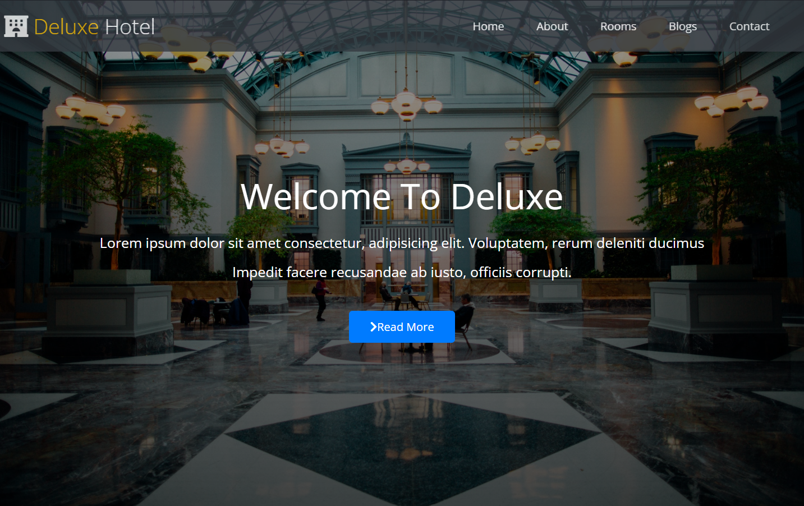

# Deluxe Hotel Website 🏨

## Overview
The Deluxe Hotel website is designed to showcase the hotel's offerings, services, and amenities. It provides information about rooms, services, customer service, and contact details. The site features a modern design with responsive navigation and attractive visuals.

## Technologies Used 🚀
- **HTML**
- **CSS (FlexBox)**
- **Font Awesome Icons**

## Usage 💻
1. Navigate through the sections using the top navigation bar.
2. Explore hotel services, rooms, and team members.
3. Contact the hotel using the provided form.

## Responsive Design 📱
- The website is fully responsive, ensuring a seamless experience on various devices.
- Responsive navigation bar for easy access to all sections.
- Gallery and room sections adapt to different screen sizes.

## Live Demo 🌐
Live Demo: [Deluxe Hotel Demo](https://hotel-site-sigma.vercel.app/)

## Installation
No special installation is required for this project. Simply open the `index.html` file in a web browser.

## Contributing 🤝
Feel free to use, modify, and contribute to the project! If you have any questions or feedback, you can reach me at your nisagokdemir@gmail.com

## License
This project is licensed under the **MIT License**.

